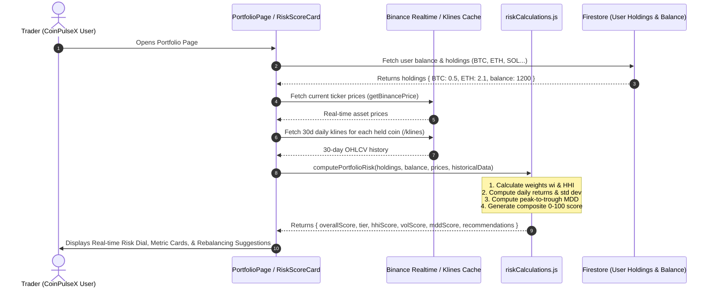

# Portfolio Risk Scoring System Specification & Implementation Guide
**Project:** CoinPulseX  
**Feature:** Real-Time Portfolio Risk Scoring (Asset Concentration, Volatility, and Historical Drawdown)  
**Status:** Design & Implementation Ready  

---

## 1. Executive Summary & Objective

The **Portfolio Risk Scoring System** is an institutional-grade risk assessment engine built directly into CoinPulseX. It dynamically evaluates a user's cryptocurrency holdings in real time using three core financial risk factors:

1. **Asset Concentration Risk (HHI)**: Measures how diversified the portfolio is across different tokens and cash reserves.
2. **Historical Volatility Risk ($\sigma$)**: Measures price fluctuations and exposure to high-beta crypto assets over 30/60-day windows.
3. **Historical Maximum Drawdown Risk (MDD)**: Assesses the historical peak-to-trough drops of current holdings to quantify downside vulnerability.

These metrics are synthesized into a **Unified Real-Time Risk Score (0–100)** with actionable insights (e.g., "High exposure to meme coins", "Heavy concentration in SOL", "Safe cash reserve ratio").

---

## 2. Technical Stack & Prerequisites

### 2.1 Already Available in CoinPulseX
- **Framework:** React 19 + Vite 6
- **Styling:** Tailwind CSS v4 (with custom cyber/dark theme)
- **State & Database:** Firebase Firestore & Firebase Auth
- **Icons:** `lucide-react`
- **Charts:** `chart.js` + `react-chartjs-2`
- **HTTP Client:** Native `fetch` / `axios`

### 2.2 Additional / Utility Requirements
- **No new heavy npm packages required!** All risk calculations (HHI, standard deviation, drawdown) can be cleanly implemented using pure JavaScript / ES6 math utilities.
- *(Optional for advanced gauge visuals)*: `chart.js` doughnut gauge or SVG circular gauge with Tailwind transitions.

### 2.3 External Data APIs
- **Binance Public REST API**:
  - `GET /api/v3/ticker/24hr?symbol={SYMBOL}`: Current price and 24h quote stats (already used).
  - `GET /api/v3/klines?symbol={SYMBOL}&interval=1d&limit=30`: 30-day historical daily close prices to compute rolling volatility and max drawdown.
- *(Free, no API key required, 1200 request weight/minute limit)*.

---

## 3. Mathematical Foundations & Risk Formulas

### 3.1 Factor 1: Asset Concentration Risk (Herfindahl-Hirschman Index)
The **Herfindahl-Hirschman Index (HHI)** is a standard economic metric for market and portfolio concentration.

1. Let $V_i$ be the market value of asset $i$, and $V_{\text{cash}}$ be the user's available CCoins balance.
2. Total portfolio value:
   $$V_{\text{total}} = V_{\text{cash}} + \sum_{i=1}^{n} V_i$$
3. Weight of asset $i$:
   $$w_i = \frac{V_i}{V_{\text{total}}}$$
   *(Note: Cash/CCoins is treated as zero volatility and low risk concentration)*.
4. Calculate Crypto HHI:
   $$\text{HHI} = \sum_{i=1}^{n} w_i^2$$
   - **Range:** From $\approx 1/n$ (ideal diversification) to $1.0$ (100% in a single coin).
5. Concentration Risk Score ($S_{\text{conc}} \in [0, 100]$):
   $$S_{\text{conc}} = \text{round}\left(\text{HHI} \times 100 \times (1 - w_{\text{cash}})\right)$$
   *(If cash represents 50% of total balance, concentration risk is naturally buffered).*

---

### 3.2 Factor 2: Portfolio Volatility Risk ($\sigma_{\text{annual}}$)
Volatility measures the frequency and severity of price fluctuations over a 30-day window.

1. Daily returns of asset $i$ over $T = 30$ days:
   $$R_{i, t} = \frac{P_{i, t} - P_{i, t-1}}{P_{i, t-1}}$$
2. Daily sample standard deviation:
   $$\sigma_{i, \text{daily}} = \sqrt{\frac{1}{T-1} \sum_{t=1}^{T} (R_{i, t} - \bar{R}_i)^2}$$
3. Annualized crypto volatility:
   $$\sigma_{i, \text{annual}} = \sigma_{i, \text{daily}} \times \sqrt{365}$$
4. Weighted portfolio annualized volatility:
   $$\sigma_{\text{portfolio}} = \sum_{i=1}^{n} (w_i \times \sigma_{i, \text{annual}})$$
5. Volatility Risk Score ($S_{\text{vol}} \in [0, 100]$):
   - Benchmark: In crypto, $\sigma_{\text{annual}} \approx 30\%$ is low (e.g., BTC/stables), while $\ge 120\%$ is hyper-volatile (meme coins/low caps).
   $$S_{\text{vol}} = \min\left(100, \max\left(0, \frac{\sigma_{\text{portfolio}}}{1.20} \times 100\right)\right)$$

---

### 3.3 Factor 3: Historical Maximum Drawdown Risk ($\text{MDD}$)
Drawdown quantifies the worst historical decline from peak to trough over the last 30–60 days for each held asset.

1. Running peak price up to day $t$:
   $$\text{Peak}_{i, t} = \max_{\tau \le t} (P_{i, \tau})$$
2. Drawdown at day $t$:
   $$DD_{i, t} = \frac{\text{Peak}_{i, t} - P_{i, t}}{\text{Peak}_{i, t}}$$
3. Asset Maximum Drawdown:
   $$\text{MDD}_i = \max_t (DD_{i, t})$$
4. Portfolio Weighted MDD:
   $$\text{MDD}_{\text{portfolio}} = \sum_{i=1}^{n} (w_i \times \text{MDD}_i)$$
5. Drawdown Risk Score ($S_{\text{drawdown}} \in [0, 100]$):
   - Benchmark: Crypto drawdowns commonly reach 50%–70% in turbulent market phases.
   $$S_{\text{drawdown}} = \min\left(100, \max\left(0, \frac{\text{MDD}_{\text{portfolio}}}{0.60} \times 100\right)\right)$$

---

### 3.4 Composite Risk Score & Risk Tiers
The final **Real-Time Risk Score** is a weighted blend:

$$\text{Total Score} = (0.35 \times S_{\text{conc}}) + (0.40 \times S_{\text{vol}}) + (0.25 \times S_{\text{drawdown}})$$

#### Classification Tiers:
| Score Range | Risk Level | Badge Color | Description |
| :--- | :--- | :--- | :--- |
| **0 – 30** | **Conservative / Low** | 🟢 Emerald Green | High cash reserve or well-diversified across high-cap assets with low drawdown. |
| **31 – 60** | **Balanced / Moderate** | 🟡 Amber Yellow | Moderate diversification; healthy mix of major crypto assets. |
| **61 – 80** | **Aggressive / High** | 🟠 Bright Orange | Overconcentrated in 1–2 assets or exposed to highly volatile altcoins. |
| **81 – 100** | **Extreme / Degenerate** | 🔴 Crimson Red | 90%+ in a single volatile asset or assets in steep drawdown. High liquidation risk. |

---

## 4. End-to-End Feature Flow



---

## 5. Architectural File Structure

New files and modified modules to add to `src/`:

```
src/
├── config/
│   ├── binance.js                # [MODIFY] Add fetchCoinHistoricalKlines() with caching
│   └── tradeService.js           # [EXISTING]
├── utils/
│   └── riskCalculations.js       # [NEW] Pure calculation engine (HHI, Volatility, MDD, Score)
├── components/
│   ├── PortfolioRisk/
│   │   ├── RiskScoreCard.jsx     # [NEW] Main hero widget with Gauge & Risk Badge
│   │   ├── RiskMetricPill.jsx    # [NEW] Compact cards for HHI, Volatility, and Drawdown
│   │   ├── RiskInsights.jsx      # [NEW] AI/Automated rebalancing warnings & tips
│   │   └── RiskDetailsModal.jsx  # [NEW] Deep-dive popup explaining the math & breakdowns
└── pages/
    └── PortfolioPage.jsx         # [MODIFY] Integrate RiskScoreCard above or beside holdings
```

---

## 6. Implementation Code Blueprints

### 6.1 `src/utils/riskCalculations.js` (Calculation Engine)

```javascript
/**
 * Calculates standard deviation of an array of numbers
 */
const calculateStdDev = (arr) => {
  if (!arr || arr.length <= 1) return 0;
  const mean = arr.reduce((acc, val) => acc + val, 0) / arr.length;
  const variance = arr.reduce((acc, val) => acc + Math.pow(val - mean, 2), 0) / (arr.length - 1);
  return Math.sqrt(variance);
};

/**
 * Calculates 30-day annualized volatility from daily closing prices
 */
export const calculateAssetVolatility = (prices) => {
  if (!prices || prices.length < 5) return 0.5; // fallback baseline 50%
  const returns = [];
  for (let i = 1; i < prices.length; i++) {
    const prev = prices[i - 1];
    const curr = prices[i];
    if (prev > 0) returns.push((curr - prev) / prev);
  }
  const dailyStdDev = calculateStdDev(returns);
  return dailyStdDev * Math.sqrt(365); // Annualized
};

/**
 * Calculates historical Maximum Drawdown (MDD) from daily closing prices
 */
export const calculateAssetMaxDrawdown = (prices) => {
  if (!prices || prices.length < 2) return 0;
  let peak = prices[0];
  let maxDrawdown = 0;

  for (const price of prices) {
    if (price > peak) {
      peak = price;
    }
    const drawdown = (peak - price) / peak;
    if (drawdown > maxDrawdown) {
      maxDrawdown = drawdown;
    }
  }
  return maxDrawdown;
};

/**
 * Main function to evaluate entire portfolio risk
 */
export const computePortfolioRisk = ({ holdings = {}, cashBalance = 0, currentPrices = {}, historicalKlines = {} }) => {
  const assetValues = {};
  let totalCryptoValue = 0;

  // Calculate individual asset values
  Object.entries(holdings).forEach(([coin, amount]) => {
    const price = currentPrices[coin]?.price || 0;
    const val = amount * price;
    assetValues[coin] = val;
    totalCryptoValue += val;
  });

  const totalPortfolioValue = totalCryptoValue + cashBalance;

  // Edge case: empty portfolio
  if (totalPortfolioValue <= 0) {
    return {
      score: 0,
      tier: "Unfunded",
      color: "text-gray-400",
      bgGradient: "from-gray-800 to-gray-900",
      concentrationScore: 0,
      volatilityScore: 0,
      drawdownScore: 0,
      hhi: 0,
      portfolioVolatility: 0,
      portfolioDrawdown: 0,
      insights: ["Add funds or purchase crypto to view your real-time risk score."]
    };
  }

  // 1. Asset Weights & HHI Concentration
  let hhi = 0;
  let dominantCoin = null;
  let dominantWeight = 0;

  Object.entries(assetValues).forEach(([coin, val]) => {
    const weight = val / totalPortfolioValue;
    hhi += Math.pow(weight, 2);
    if (weight > dominantWeight) {
      dominantWeight = weight;
      dominantCoin = coin;
    }
  });

  const cashWeight = cashBalance / totalPortfolioValue;
  // Concentration score (0-100)
  const concentrationScore = Math.min(100, Math.round(hhi * 100));

  // 2. Volatility Calculation
  let portfolioVolatility = 0;
  const assetVolatilities = {};

  Object.entries(assetValues).forEach(([coin, val]) => {
    const weight = val / totalPortfolioValue;
    const klinePrices = historicalKlines[coin] || [];
    const assetVol = calculateAssetVolatility(klinePrices);
    assetVolatilities[coin] = assetVol;
    portfolioVolatility += weight * assetVol;
  });

  // Benchmark: 120% annual vol = 100 score
  const volatilityScore = Math.min(100, Math.round((portfolioVolatility / 1.2) * 100));

  // 3. Maximum Drawdown Calculation
  let portfolioDrawdown = 0;
  const assetDrawdowns = {};

  Object.entries(assetValues).forEach(([coin, val]) => {
    const weight = val / totalPortfolioValue;
    const klinePrices = historicalKlines[coin] || [];
    const mdd = calculateAssetMaxDrawdown(klinePrices);
    assetDrawdowns[coin] = mdd;
    portfolioDrawdown += weight * mdd;
  });

  // Benchmark: 60% drawdown = 100 score
  const drawdownScore = Math.min(100, Math.round((portfolioDrawdown / 0.6) * 100));

  // 4. Composite Score
  const rawScore = (concentrationScore * 0.35) + (volatilityScore * 0.40) + (drawdownScore * 0.25);
  const score = Math.min(100, Math.max(1, Math.round(rawScore)));

  // 5. Tiering & Visual Metadata
  let tier = "Low Risk";
  let color = "text-emerald-400";
  let bgGradient = "from-emerald-950/40 to-gray-900 border-emerald-500/30";

  if (score > 80) {
    tier = "Extreme Risk";
    color = "text-rose-500";
    bgGradient = "from-rose-950/40 to-gray-900 border-rose-500/40";
  } else if (score > 60) {
    tier = "High Risk";
    color = "text-amber-500";
    bgGradient = "from-amber-950/40 to-gray-900 border-amber-500/30";
  } else if (score > 30) {
    tier = "Moderate Risk";
    color = "text-yellow-400";
    bgGradient = "from-yellow-950/30 to-gray-900 border-yellow-500/30";
  }

  // 6. Actionable Real-Time Insights
  const insights = [];
  if (dominantWeight > 0.6) {
    insights.push(`High concentration: ${(dominantWeight * 100).toFixed(0)}% of your capital is in ${dominantCoin?.toUpperCase()}. Consider rebalancing.`);
  }
  if (portfolioVolatility > 0.8) {
    insights.push(`Heightened volatility: Holdings experience rapid swings (>80% annualized volatility).`);
  }
  if (portfolioDrawdown > 0.35) {
    insights.push(`Significant drawdown risk: Portfolio assets have dropped ${(portfolioDrawdown * 100).toFixed(0)}% from recent peaks.`);
  }
  if (cashWeight > 0.3) {
    insights.push(`Healthy cash buffer: ${(cashWeight * 100).toFixed(0)}% in CCoins dampens overall portfolio risk.`);
  }
  if (insights.length === 0) {
    insights.push(`Portfolio is well balanced with optimal exposure across active crypto pairs.`);
  }

  return {
    score,
    tier,
    color,
    bgGradient,
    totalPortfolioValue,
    concentrationScore,
    volatilityScore,
    drawdownScore,
    hhi: (hhi).toFixed(3),
    portfolioVolatility: (portfolioVolatility * 100).toFixed(1) + "%",
    portfolioDrawdown: (portfolioDrawdown * 100).toFixed(1) + "%",
    dominantAsset: dominantCoin ? { coin: dominantCoin, weight: (dominantWeight * 100).toFixed(1) + "%" } : null,
    insights
  };
};
```

---

### 6.2 Binance Historical Kline Helper in `src/config/binance.js`

```javascript
// Add to src/config/binance.js with in-memory 5-minute cache to avoid rate limits
const klinesCache = new Map();
const CACHE_TTL = 5 * 60 * 1000; // 5 minutes

export const getBinanceHistoricalKlines = async (symbol = "BTCUSDT", limit = 30) => {
  const cacheKey = `${symbol}_${limit}`;
  const cached = klinesCache.get(cacheKey);

  if (cached && (Date.now() - cached.timestamp < CACHE_TTL)) {
    return cached.data;
  }

  try {
    const res = await fetch(
      `https://api.binance.com/api/v3/klines?symbol=${symbol.toUpperCase()}&interval=1d&limit=${limit}`
    );
    if (!res.ok) throw new Error(`Binance API error: ${res.status}`);
    const raw = await res.json();
    // Index 4 is the closing price
    const closePrices = raw.map((entry) => parseFloat(entry[4]));
    
    klinesCache.set(cacheKey, { data: closePrices, timestamp: Date.now() });
    return closePrices;
  } catch (err) {
    console.warn(`Failed to fetch klines for ${symbol}:`, err);
    return [];
  }
};
```

---

### 6.3 Hero Risk UI Component: `src/components/PortfolioRisk/RiskScoreCard.jsx`

```jsx
import React from "react";
import { ShieldAlert, ShieldCheck, AlertTriangle, Flame, TrendingDown, PieChart, Activity } from "lucide-react";

export const RiskScoreCard = ({ riskData, onOpenDetails }) => {
  if (!riskData) return null;

  const {
    score,
    tier,
    color,
    bgGradient,
    concentrationScore,
    volatilityScore,
    drawdownScore,
    portfolioVolatility,
    portfolioDrawdown,
    dominantAsset,
    insights
  } = riskData;

  const getIcon = () => {
    if (score > 80) return <Flame className="w-7 h-7 text-rose-500 animate-pulse" />;
    if (score > 60) return <ShieldAlert className="w-7 h-7 text-amber-500" />;
    if (score > 30) return <AlertTriangle className="w-7 h-7 text-yellow-400" />;
    return <ShieldCheck className="w-7 h-7 text-emerald-400" />;
  };

  return (
    <div className={`rounded-2xl p-6 mb-8 border backdrop-blur-md bg-gradient-to-br ${bgGradient} transition-all duration-300 shadow-xl`}>
      <div className="flex flex-col md:flex-row md:items-center justify-between gap-6">
        {/* Left: Score Gauge & Risk Tier */}
        <div className="flex items-center space-x-6">
          <div className="relative flex items-center justify-center w-24 h-24 rounded-full bg-gray-950 border-4 border-gray-800 shadow-inner">
            <div className="text-center">
              <span className={`text-3xl font-black ${color}`}>{score}</span>
              <span className="text-[10px] block text-gray-400 uppercase tracking-wider font-semibold">/ 100</span>
            </div>
            {/* SVG Ring Accent */}
            <svg className="absolute inset-0 w-full h-full -rotate-90" viewBox="0 0 36 36">
              <path
                className="text-gray-800"
                strokeWidth="3"
                stroke="currentColor"
                fill="none"
                d="M18 2.0845 a 15.9155 15.9155 0 0 1 0 31.831 a 15.9155 15.9155 0 0 1 0 -31.831"
              />
              <path
                className={score > 80 ? "text-rose-500" : score > 60 ? "text-amber-500" : score > 30 ? "text-yellow-400" : "text-emerald-400"}
                strokeDasharray={`${score}, 100`}
                strokeWidth="3"
                strokeLinecap="round"
                stroke="currentColor"
                fill="none"
                d="M18 2.0845 a 15.9155 15.9155 0 0 1 0 31.831 a 15.9155 15.9155 0 0 1 0 -31.831"
              />
            </svg>
          </div>

          <div>
            <div className="flex items-center space-x-2">
              {getIcon()}
              <h2 className="text-2xl font-bold text-white tracking-tight">{tier}</h2>
            </div>
            <p className="text-sm text-gray-400 mt-1 max-w-md">
              Real-time portfolio stress rating synthesized from asset concentration, volatility index, and 30-day max drawdown.
            </p>
          </div>
        </div>

        {/* Right: Sub-factor Breakdown Badges */}
        <div className="grid grid-cols-3 gap-3 w-full md:w-auto">
          {/* Concentration */}
          <div className="bg-gray-900/80 border border-gray-800 p-3 rounded-xl flex flex-col items-center justify-center min-w-[100px]">
            <div className="flex items-center space-x-1 text-cyan-400 mb-1">
              <PieChart className="w-4 h-4" />
              <span className="text-xs font-semibold">Concentration</span>
            </div>
            <span className="text-lg font-bold text-white">{concentrationScore}</span>
            <span className="text-[11px] text-gray-400 truncate max-w-[90px]">
              {dominantAsset ? `${dominantAsset.coin}: ${dominantAsset.weight}` : "Even"}
            </span>
          </div>

          {/* Volatility */}
          <div className="bg-gray-900/80 border border-gray-800 p-3 rounded-xl flex flex-col items-center justify-center min-w-[100px]">
            <div className="flex items-center space-x-1 text-purple-400 mb-1">
              <Activity className="w-4 h-4" />
              <span className="text-xs font-semibold">Volatility</span>
            </div>
            <span className="text-lg font-bold text-white">{volatilityScore}</span>
            <span className="text-[11px] text-gray-400">{portfolioVolatility}</span>
          </div>

          {/* Drawdown */}
          <div className="bg-gray-900/80 border border-gray-800 p-3 rounded-xl flex flex-col items-center justify-center min-w-[100px]">
            <div className="flex items-center space-x-1 text-red-400 mb-1">
              <TrendingDown className="w-4 h-4" />
              <span className="text-xs font-semibold">Drawdown</span>
            </div>
            <span className="text-lg font-bold text-white">{drawdownScore}</span>
            <span className="text-[11px] text-gray-400">{portfolioDrawdown}</span>
          </div>
        </div>
      </div>

      {/* Actionable Insights Banner */}
      {insights && insights.length > 0 && (
        <div className="mt-4 pt-4 border-t border-gray-800/80 flex flex-col sm:flex-row sm:items-center justify-between gap-2">
          <div className="flex items-center space-x-2 text-sm text-gray-300">
            <span className="inline-block w-2 h-2 rounded-full bg-cyan-400 animate-ping" />
            <span><strong className="text-cyan-300">Insight:</strong> {insights[0]}</span>
          </div>
          {onOpenDetails && (
            <button
              onClick={onOpenDetails}
              className="text-xs text-cyan-400 hover:text-cyan-300 underline font-medium self-start sm:self-auto cursor-pointer"
            >
              View Risk Breakdown →
            </button>
          )}
        </div>
      )}
    </div>
  );
};
```

---

## 7. Integration in `PortfolioPage.jsx`

In `src/pages/PortfolioPage.jsx`:
1. In `fetchData(user)`:
   - After fetching `prices`, iterate over `symbols` and call `getBinanceHistoricalKlines(coin, 30)` to populate `historicalKlines`.
2. Compute `riskData = computePortfolioRisk({ holdings, cashBalance, currentPrices, historicalKlines })`.
3. Render `<RiskScoreCard riskData={riskData} />` directly above the crypto holdings grid.

---

## 8. Real-Time Strategy & Edge Cases

| Scenario | Behavior / Mitigation |
| :--- | :--- |
| **New or Empty Account** | Show `Score: 0` / `Unfunded` status with a CTA to trade or deposit. |
| **1 Single Coin Holding** | HHI concentration score is $100$. Risk level reflects coin's volatility + drawdown. |
| **High Cash Ratio** | Cash balance reduces concentration and has zero volatility, pulling the composite risk downward. |
| **Binance API Rate Limits** | In-memory 5-minute cache on historical klines (`/klines`) so frequent 10-second ticker refreshes don't spam the kline endpoint. |
| **Unknown Token / New Coin** | Graceful fallback default volatility (60%) and 0% drawdown if klines are unavailable. |

---

## 9. Next Steps for Implementation
1. Add `src/utils/riskCalculations.js`.
2. Add `getBinanceHistoricalKlines` in `src/config/binance.js`.
3. Create `src/components/PortfolioRisk/RiskScoreCard.jsx`.
4. Plug into `src/pages/PortfolioPage.jsx`.
5. Verify in browser with test portfolios!
